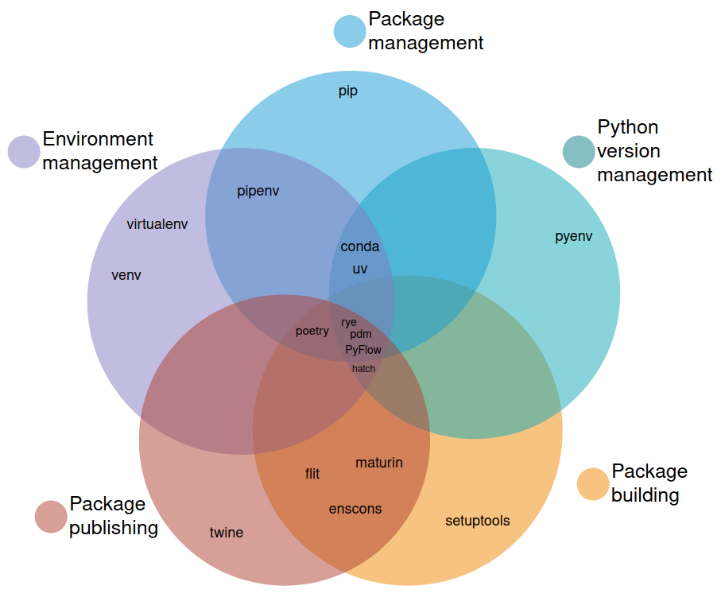
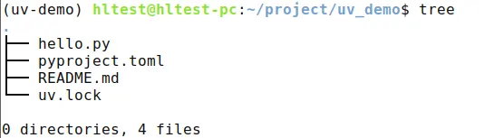

## 前言

开发过程中接触到了 Go Modules 和 Rust Cargo 两种包管理工具，它们在管理依赖、构建和版本控制方面给程序员带来了极大便利，而在经常接触的 Python 语言中，并没有一款具有统治能力的包、环境管理工具。Google 一下会有各种五花八门的工具，有一张图[原文链接](https://alpopkes.com/posts/python/packaging_tools/)介绍了常见的工具及其功能：：


近年来，由于Rust语言的火热，很多构建、管理工具都被使用 Rust 语言重构，于是我准备去寻找一款集 Python 的包和环境管理一体的工具。果然被我找到一款工具，接下来我将介绍 Python 生态系统中最有希望成为 Python 的 Cargo 的工具---uv。

## 介绍
uv 是由 Astral 公司开发，用 Rust 编写的快速 Python 包管理器。它最初作为 pip 工作流的替代品推出，如今已扩展成为一个端到端的解决方案，能够管理 Python 项目、命令行工具、单文件脚本甚至 Python 本身。uv 就像是 Python 界的 Cargo，为开发者提供了一个快速、可靠、易用的统一接口。

uv 具有多项突出的特性。首先，uv 与 poetry 一样，支持使用 pyproject.toml 描述项目的依赖、构建、发布等信息；其次，uv 使用回溯方法进行依赖项解析，与 pip 不同的是，该算法使用 Rust 编写的，速度非常快。

所有这些功能都基于 uv 极快的跨平台依赖解析器。uv 在性能和可靠性上都有突出的优势，无论是小型脚本还是大型项目，从初学者到专家，都能很好地满足 Python 开发的各种需求。
## 安装
### 安装 uv
uv 可以通过多种方式进行安装，如下：
- 使用 curl： `curl -LsSf <https://astral.sh/uv/install.sh> |sh`
- 使用 pip： `pip install uv`
- 使用 pipx：`pipx install uv`

更多安装方式见官方文档：[https://docs.astral.sh/uv/getting-started/installation/](https://docs.astral.sh/uv/getting-started/installation/)

## 使用
### 创建虚拟环境
#### 创建环境：
```bash
# 创建虚拟环境，不加环境路径的话默认是保存在当前的.venv目录下
uv venv 

# 指定环境保存目录
uv venv /path/to/venv

# 指定Python版本，注意需要对应版本的Python已经安装
uv venv -p 3.12

# --python 同 -p
uv venv --python 3.12
```

注意：uv 工具不会自动下载 Python 包，因此如果设置`-p`时指定系统不存在的 Python 版本，则会报下面的错：

```bash
$ uv venv -p 3.13
No Python 3.13 In `PATH`. Is Python 3.13 installed?
```

使用 `uv python install` 命令安装指定版本的 python

```bash
# 查看已安装和可安装的 python 版本
uv python list

# 默认安装最新版本
uv python install

# 安装多个版本的 python
uv python install 3.12 3.13
```

启用环境的命令同 Python 的标准库 venv :
```bash
# Unix
source venv/bin/activate

# Windows
venv\\Scripts\\activate
```

### 管理 Python 项目
##### 初始化项目：
可以使用 `uv init` 命令初始化一个 Python 项目。
```bash
uv init your_project_name

# 初始化项目时也可以指定 python 版本
uv init --python=3.12

# 如果当前 shell 的解释器不是3.12，需要切换到3.12或者使用 venv
uv venv python=3.12
```

项目结构如下：



- uv.lock 是锁定的依赖，类似于 `pip freeze`
- pyproject.toml 是项目的配置文件，里面有依赖的版本信息和 python 版本信息

例如，`uv init && uv add "fastapi>=0.112"`会初始化项目并添加 fastapi 依赖，生成如下 pyproject.toml 文件：
```toml
[project]
name = "hello-world"
version = "0.1.0"
readme = "README.md"
dependencies = ["fastapi>=0.112"]
```

#### 添加依赖：
- 通过 `uv add` 命令可以添加项目依赖
```bash
uv add requests
```

通过 uv 安装包, 会进一步更新 lock 文件, 也会更新 pyproject.toml 文件, 当迁移项目时，只需要将这两个文件拷贝到新环境即可.

生成锁文件：uv 会基于项目依赖创建一个锁文件 uv.lock ，保证项目环境在不同机器上的一致性.

执行命令：通过 `uv run` 可以在项目环境中执行命令，无需手动激活虚拟环境。

```bash
uv run hello.py
```

> 这里要特别说明, 使用 uv 管理的项目，都要使用`uv run xxx.py`来运行，而不是直接使用`python xxx.py`, 因为 uv 会自动激活虚拟环境，而 python 不会。

### uv 常用命令

uv 设计兼容 pip 命令，很好记。在普通的 `pip install` 前面加一个 uv ，大部分 `pip install` 的参数都支持：

#### 安装包

```bash
# 原生命令
uv add requests pandas        # 安装包
uv add requests==2.31.0      # 指定版本

# pip 兼容
uv pip install requests pandas
uv pip install requests==2.31.0
```

一个非常重要的点：uv 默认不会读`pip.conf`这种类型的镜像配置，因此在国内的话，包的默认下载速度是比较慢的，需要手动加`--index-url/-i`和`-extra-index-url`，才能达到比较快的下载速度。

#### 卸载包
```bash
# 原生命令
uv remove requests           # 卸载包

# pip 兼容
uv pip uninstall requests
```

#### 同步依赖
```bash
# 原生命令
uv sync                     # 同步依赖

# pip 兼容
uv pip sync                 # pip-sync 兼容模式
```

拿到 requirements.txt 后，就可以用 `uv pip sync` 命令来将其中的版本信息更新到当前的虚拟环境

```bash
uv pip sync requirements.txt
```

#### 导出依赖

```bash
# pip 兼容
uv pip freeze > requirements.txt             # 导出依赖
```

#### 编译依赖

```bash
# pip 兼容
uv pip compile requirements.in

uv pip compile pyproject.toml -o requirements.txt
```

利用`uv pip compile`，可以方便地将当前环境所有安装的包以及它们的依赖的版本都导出到requirements.txt 中，然后在别的机器上快速复现同样的安装环境。

#### 一般建议：
- 优先使用原生命令（更快、更简洁）
- 需要特殊 pip 选项时使用 pip 兼容命令
### 管理命令行工具
#### 安装：
通过 `uv tool install` 可以把命令行工具（如 Ruff）安装到隔离的虚拟环境中。
执行一次性命令：通过 `uvx`（uv tool run 的别名）可以直接执行命令而无需安装，例如 `uvx ruff check`。

### 执行单文件脚本
对于没有包含任何元数据但有依赖的脚本，如 `main.py`，可以通过`uv add --script main.py 'requests<3' 'rich'`将依赖声明嵌入到脚本中。
 然后使用 `uv run main.py` 即可在隔离环境中执行脚本并自动安装依赖。
 
## 优势
1. 速度超快。uv 比没有缓存的`pip`和`pip-tools`**快 8-10 倍**，并且**快 80-115 倍** 当使用热缓存运行时（例如，重新创建虚拟环境或更新依赖项）。
2. 节省磁盘空间。具有全局缓存，可重复使用依赖项，节省磁盘空间。
3. 兼容 pip 命令，低学习成本。uv 提供了一个熟悉的 API ，仅需在原来使用的 pip 命令前加上 uv 即可使用 uv 来提高下载速度。例如：允许使用 `uv pip install` 这样的命令来安装 Python 依赖项。
4. 虚拟环境管理：`uv` 可以用作虚拟环境管理器，比 `python -m venv` 快 80 倍。
## 总结
uv 作为一款强大的 Python 包管理工具，其功能强大、简单易用的特点在众多方面得到了充分体现。无论是端到端项目管理、工具管理、Python 安装还是脚本执行，uv 都展现出了卓越的性能和可靠性。

在端到端项目管理方面，uv 通过 `uv run`、`uv lock` 和 `uv sync` 等命令，能够基于标准元数据生成跨平台的锁文件，并从中安装依赖。这一功能使得大型项目的依赖安装和解析更加快速，提高了开发效率，同时也保证了项目环境在不同机器上的一致性，为团队协作提供了便利。

`uv python install` 在 Python 安装方面有着独特的优势，可以自动下载安装 Python，类似 pyenv 但更高效。这使得开发者在搭建开发环境时更加轻松快捷，无需繁琐的手动操作。

综上所述，uv 作为 Python 包管理工具，功能强大、简单易用，降低了 Python 开发的复杂度，提高了生产力。希望有一天，Python 包管理能够像 Go 、Rust 和 JavaScript 的包管理那样简单易用并且统一。

## 参考
[uv 官方文档](https://docs.astral.sh/uv/)
[python 各种包环境工具盘点](https://alpopkes.com/posts/python/packaging_tools/)
